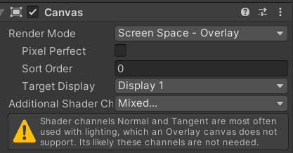

## What is a Canvas?

The Canvas is a Game Object with a Canvas component on it, and all UI elements must be children of such a Canvas. If you want to create an image inside the canvas then you can go to the menu **GameObject > UI > Image.** If there isn't already a Canvas in the scene, then it automatically creates a Canvas. The Canvas area is shown as a rectangle in the Scene View, which helps the user to position the UI elements easily.

### Render Modes

The Canvas has a **Render Mode** setting which can be used to make it render in screen space or world space.

- **Screen Space - Overlay -**
    
    This render mode places UI elements on the screen rendered on top of the scene. If the screen is resized or changes resolution, the Canvas will automatically change the size to match this.
    
- **Screen Space - Camera** **-**
    
    In this render mode, the canvas is placed at a given distance in front of the camera. The UI elements are rendered by this camera, which means that the Camera settings will affect the appearance of the UI. If the screen is resized, changes resolution, the Canvas will automatically change the size to match as well.
    
- **World Space -**
    
    In this render mode, the Canvas will behave like other objects in the scene. The size of the Canvas can be set manually using its Rect Transform, and UI elements will render in front of or behind other objects in the scene. This is useful for UIs that are meant to be a part of the world.
    

