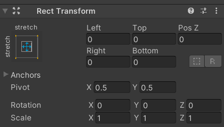
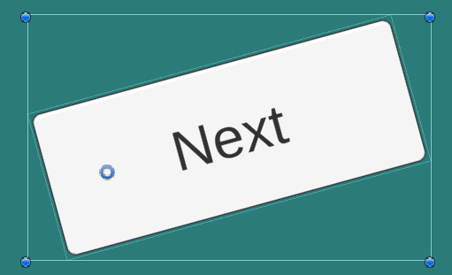
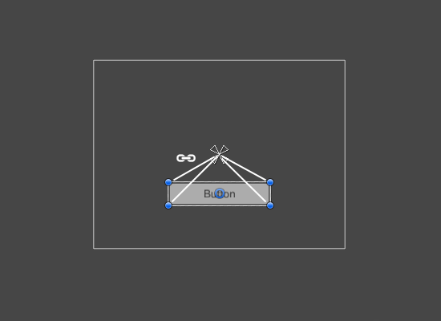
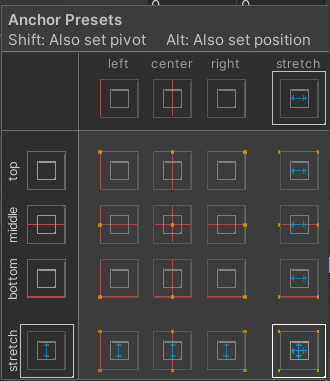

## Layout

- **Rect Transform -**
    
    The Rect Transform is a transform component that is used for all UI elements. It has position, rotation, and scale just like other transforms, but also has a width and height to specify the dimensions of the rectangle.
    

- **Pivot -**
    
    The pivot affects the outcome of a rotation, resizing, or scaling. When the toolbar Pivot button is set to Pivot mode, the pivot of a Rect Transform can be moved in the Scene View.
    

- **Anchors -**
    
    Rect transform includes a layout concept called anchors. Anchors are shown as four small triangles in the scene view. If Rect transform is attached to a parent Rect transform, then the child Rect Transform can be anchored to the parent one in many different ways like to the center or to any of the corners. A useful feature of the anchor handles is that they automatically snap to the anchors of sibling rectangles to allow for precise positioning.
    

- **Anchors presets -**
    
    This option can be found in the inspector, it is present in the upper left corner of the Rect transform component. By clicking this button it brings up the anchors presets option, in which there are some pre-defined anchor positions. You can use those anchor positions to set your UI element. You can anchor the element to the center, or to the sides, or you can stretch them along the horizontal, vertical, or in both directions.
    

##
