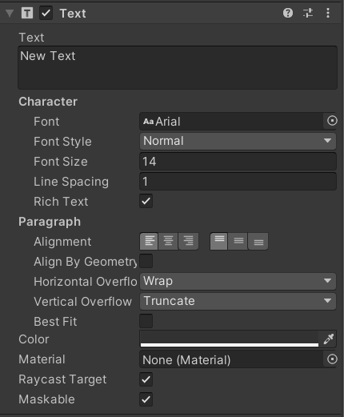
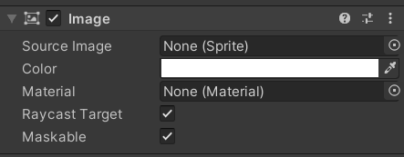
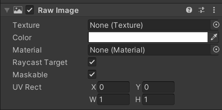
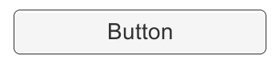
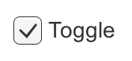
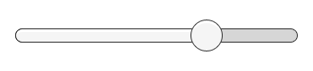

## Components

- **Text -**
    
    The **Text** component has a text area for entering the text that will be displayed. It is possible to set the font, font style, font size, and whether or not the text has rich text capability. There are options to set the alignment of the text, settings for horizontal and vertical overflow which control what happens if the text is larger than the width or height of the rectangle, and a Best Fit option that makes the text resize to fit the available space.
    

- **Image -**
    
    An Image has a Rect Transform component and an Image component. A sprite can be applied to the Image component under the Source image, and its color can be set in the Color field. Material can also be applied to the Image component. The Image Type field defines how the applied sprite will appear - 
    
    - **Simple** - Scales the whole sprite equally.
    - **Sliced** - Utilises the 3x3 sprite division so that resizing does not distort corners and only the center part is stretched.
    - **Tiled** - Similar to Sliced, but tiles (repeats) the center part rather than stretching it. For sprites with no borders at all, the entire sprite is tiled.
    - **Filled** - Shows the sprite in the same way as Simple does except that it fills in the sprite from an origin in a defined direction, method and amount.

- **Raw Image -**
    
    The Image component takes a sprite but the Raw Image takes a texture (no borders etc). Raw Image should only be used if necessary otherwise Image will be suitable in the majority of cases.
    

- **Button -**
    
    A Button has an OnClick UnityEvent to define what it will do when clicked. The Button
     control responds to a click from the user and is used to initiate an action.
    

- **Toggle -**
    
    A Toggle has an Is On checkbox that determines whether the Toggle is currently on or off. This value is flipped when the user clicks the Toggle, and a visual checkmark can be turned on or off accordingly. It also has an OnValueChanged ****UnityEvent to define what it will do when the value is changed.
    

- **Toggle Group -**
    
    A Toggle Group can be used to group a set of Toggles. It is designed in such a way that only one of them can be selected at a time - selecting one of them automatically deselects all the others.
    
- **Slider -**
    
    A Slider has a decimal number Value that the user can drag between a minimum and maximum value. It can be either horizontal or vertical. It also has an OnValueChanged UnityEvent to define what it will do when the value is changed.
    

---

Here is the implementation of how to make a responsive UI for different resolutions.

Click Here - [Github Solution repository](https://github.com/outscal/UI_Project/tree/Solution)

